# **Hybrid HPC Scheduler**

HybridHPCScheduler is an experimental framework for the development of an AI-based APIC system.
It is designed to support intelligent scheduling and resource orchestration in heterogeneous HPC environments.

This project implements an advanced hybrid HPC scheduler designed for heterogeneous computing environments. 
It introduces a segment-aware scheduling strategy that captures fine-grained execution characteristics across diverse hardware resources, 
including CPUs, GPUs, and other accelerators.

At its core, the system models a multi-device resource space, enabling efficient allocation and coordination of tasks across heterogeneous architectures. 
The scheduling problem is formulated and solved using a constraint programming approach based on the CP-SAT solver, 
allowing for optimal or near-optimal decisions under complex constraints such as resource contention, task dependencies, and execution segments.

To explore adaptive and learning-based strategies, the project integrates a custom Gymnasium environment that formalizes the scheduling process 
as a reinforcement learning problem. On top of this environment, a Proximal Policy Optimization (PPO) agent is trained to learn 
dynamic scheduling policies that can generalize across workloads and system configurations.

The framework also includes a comprehensive multi-episode benchmarking pipeline, enabling systematic evaluation of scheduling strategies over varied scenarios.
Results and performance metrics can be exported in multiple formats, including CSV for analysis, PNG for visualization, and JSONL for structured 
logging and reproducibility.

Overall, this project provides a unified platform combining constraint-based optimization and reinforcement learning to address 
next-generation scheduling challenges in heterogeneous high-performance computing systems.

For now, it is only a draft that is evolving as it progresses...

***

## Mathematical Formulation

`HybridHPCScheduler` implements a **segment-aware heterogeneous scheduling system** for high-performance computing environments.  

The core problem is to schedule a set of jobs, each decomposed into ordered segments that may run on different types of devices (e.g., CPU, GPU, other accelerators), under resource capacity, precedence, and non-overlap constraints.

The scheduler can solve this problem using:

- a **CP-SAT solver** (constraint programming), and/or  
- a **reinforcement learning** approach based on a **Gymnasium** environment and **PPO** (Proximal Policy Optimization).

### Problem Setting

Let:
- `J = {1, 2, ..., n}` be the set of jobs,
- `S_j = {1, 2, ..., m_j}` be the ordered set of segments of job `j`,
- `R = {1, 2, ..., p}` be the set of heterogeneous resources (devices),
- `d_{j,s} > 0` be the processing time (duration) of segment `(j,s)`,
- `R_{j,s} subseteq R` be the set of feasible resources for segment `(j,s)`.

Each segment \((j,s)\) may:

- require a specific type of device (e.g., GPU-only segment),
- have different durations depending on the assigned resource,
- be subject to precedence constraints with other segments of the same job or other jobs.

### Decision Variables

For each segment \((j,s)\) and resource \(r \in R\), we define:

For each segment `(j,s)` and resource `r ∈ R`, we define:

- `x_{j,s,r} ∈ {0,1}`: binary variable, equal to 1 if segment `(j,s)` is assigned to resource `r`, and 0 otherwise,
- `t_{j,s} ≥ 0`: start time of segment `(j,s)`,
- `c_{j,s}`: completion time of segment `(j,s)`, defined as:

$$
c_{j,s} = t_{j,s} + d_{j,s}
$$

The **makespan** (total completion time of all jobs) is:

$$
C_{\max} = \max_{j \in J, s \in S_j} c_{j,s}.
$$

When needed, we can also define auxiliary binary variables for ordering on a resource:

- `z_{a,b,r} in {0,1}`: equals 1 if segment `a` is scheduled before segment `b` on resource `r`.

### Objective Function

The primary objective is to **minimize the makespan**:

$$
\min C_{\max}.
$$

Optionally, the objective can be extended to include additional terms, for example:

$$
\min \Big( \alpha C_{\max} + \beta \sum_{j,s} t_{j,s} + \gamma \sum_{j,s,r} cost_{j,s,r} x_{j,s,r} \Big)
$$

where:

- `α, β, γ` are user-defined weights,
- `cost_{j,s,r}` can represent energy cost, monetary cost, or resource-specific penalty.

### Constraints

#### 1. Unique Resource Assignment

Each segment must be assigned to exactly one feasible resource:

$$
\sum_{r \in R_{j,s}} x_{j,s,r} = 1 
\quad \forall j \in J,\; \forall s \in S_j.
$$

If a segment cannot run on a resource, that variable is simply not defined or set to 0.

#### 2. Precedence Constraints

Segments of the same job must follow their internal order. For each job \(j\) and each segment \(s < m_j\):

$$
t_{j,s+1} \ge c_{j,s}
\quad \forall j \in J,\; \forall s \in \{1, \dots, m_j-1\}.
$$

More general precedence relations can be expressed as:

$$
t_v \ge c_u
\quad \text{for each dependency } u \to v.
$$

#### 3. Non-Overlap on Shared Resources

Two segments cannot run at the same time on the same resource.  
For any two distinct segments \(a = (j,s)\) and \(b = (j',s')\) and any resource \(r\), if both are assigned to \(r\) then:

$$
t_a + d_a \le t_b 
\quad \text{or} \quad
t_b + d_b \le t_a.
$$

In a CP-SAT formulation, this is typically linearized using ordering variables:

$$
t_a + d_a \le t_b + M (1 - z_{a,b,r}), \\
t_b + d_b \le t_a + M z_{a,b,r},
$$

where \(M\) is a large constant and \(z_{a,b,r} \in \{0,1\}\).

#### 4. Resource Feasibility

A segment can only be assigned to resources in its feasible set:

$$
x_{j,s,r} = 0 
\quad \forall r \notin R_{j,s}.
$$

In practice, this is enforced by only creating variables \(x_{j,s,r}\) for \(r \in R_{j,s}\).

#### 5. Horizon Constraint (Optional)

All segments must complete within a given time horizon \(T\):

$$
c_{j,s} \le T 
\quad \forall j \in J,\; \forall s \in S_j.
$$

#### 6. Variable Domains

The variables satisfy:

$$
x_{j,s,r} \in \{0,1\}, \quad
t_{j,s} \ge 0, \quad
c_{j,s} \ge 0, \quad
C_{\max} \ge 0.
$$

### Compact Problem Formulation

Putting everything together, the scheduling problem can be summarized as:

$$
\begin{aligned}
\min \quad & C_{\max} \\
\text{s.t.} \quad
& \sum_{r \in R_{j,s}} x_{j,s,r} = 1 
&& \forall j,s \\
& t_{j,s+1} \ge c_{j,s} 
&& \forall j,\; s < |S_j| \\
& c_{j,s} = t_{j,s} + d_{j,s} 
&& \forall j,s \\
& C_{\max} \ge c_{j,s} 
&& \forall j,s \\
& \text{no overlap for segments sharing the same resource} 
&& \forall r \in R \\
& x_{j,s,r} \in \{0,1\}, \; t_{j,s} \ge 0 
&& \forall j,s,r.
\end{aligned}
$$

This is a **combinatorial optimization problem** on a heterogeneous, segment-aware resource model.

### Implementation in HybridHPCScheduler

The project implements this mathematical model in two complementary ways:

1. **CP-SAT Solver**  
   - The problem is encoded as a constraint programming model.  
   - The CP-SAT solver searches for an optimal or near-optimal schedule.  
   - This approach is exact (up to a time limit) and robust for complex constraints.

2. **Reinforcement Learning (Gymnasium + PPO)**  
   - The scheduling problem is modeled as a Markov Decision Process (MDP).  
   - A **Gymnasium** environment encodes:
     - states: current resource occupancy, ready segments, time, etc.,
     - actions: assignment and ordering decisions for segments,
     - rewards: typically negative makespan or a combination of performance metrics.  
   - A **PPO** agent learns a policy that maps states to scheduling actions through multi-episode training.

The system supports:

- multi-episode benchmarking,
- comparison between CP-SAT and RL policies,
- export of results in **CSV**, **PNG**, and **JSONL** formats.

***

## My Case Study

- **devices**,
- **memory levels**,
- **network links**,
- and the **task pipeline**.

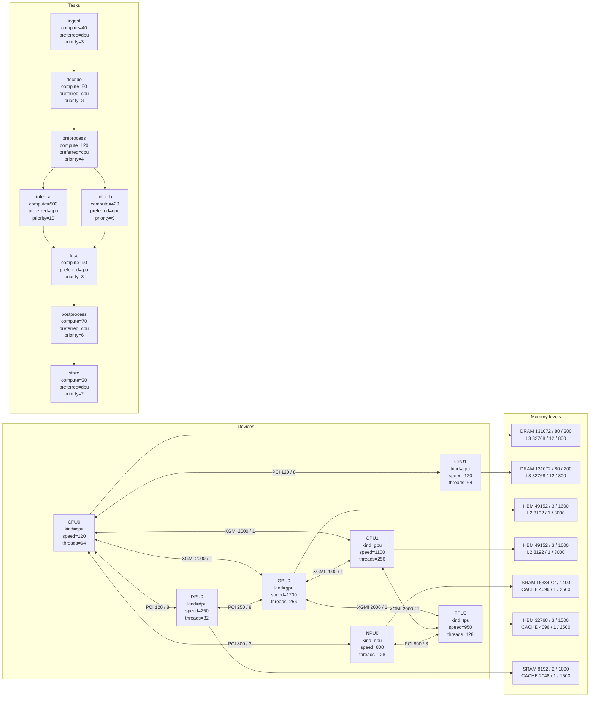
This graph separates three dimensions of the model: the **devices**, the **memory** attached to each device, and the **dependency chain** between tasks. Network connections are stylized to reflect the concepts of `bandwidth` and `latency` stored in `links`, even though Mermaid simplifies the representation of the multi-edges found in the `MultiDiGraph`.

## For more information

### Detail information Level 1

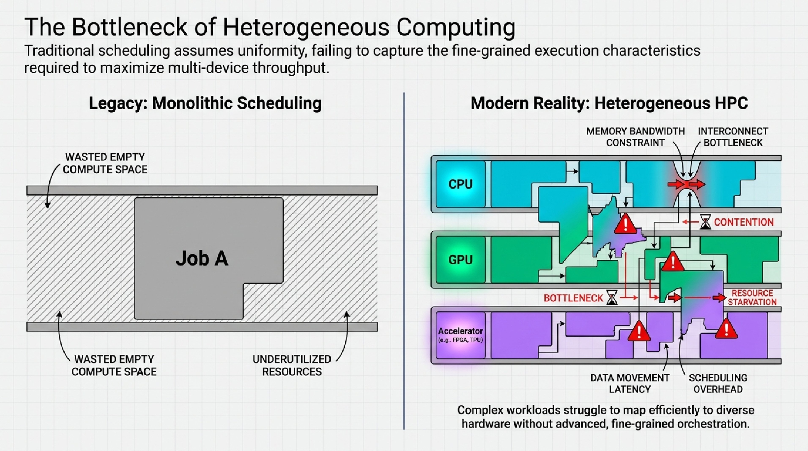
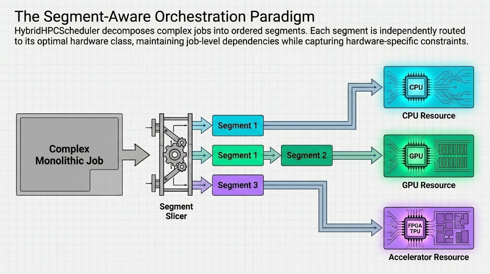
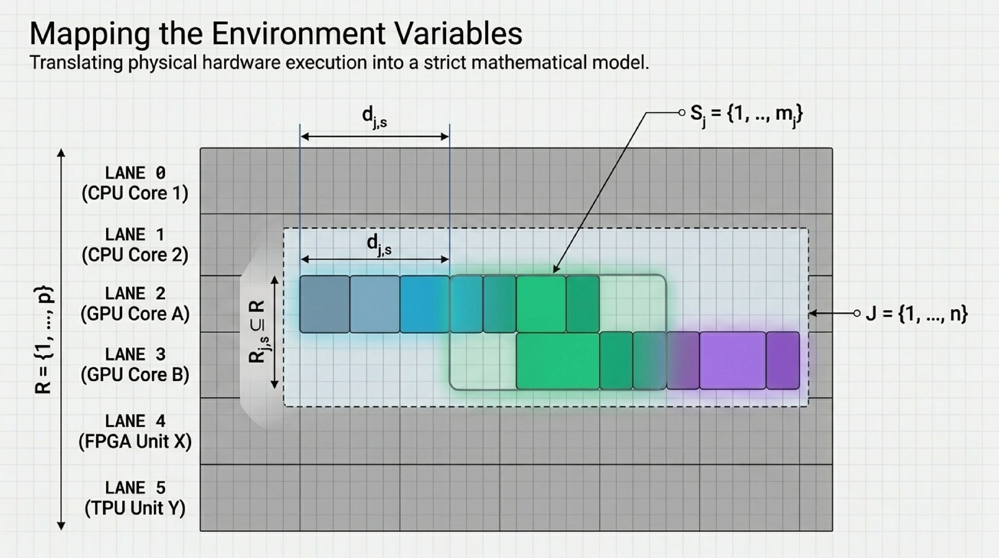
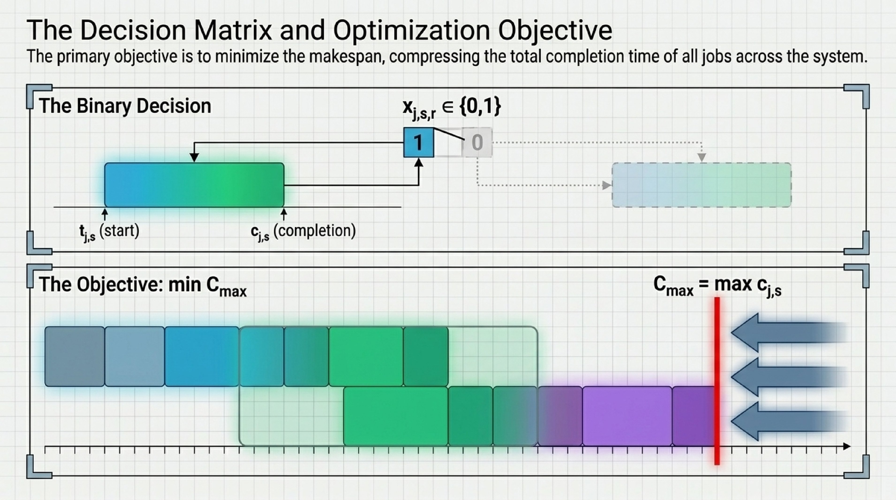
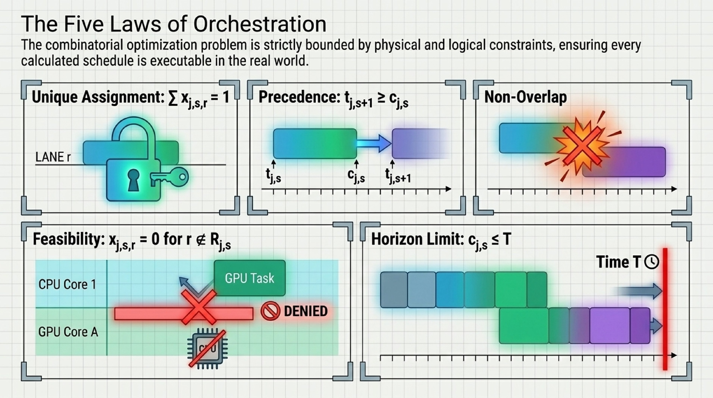
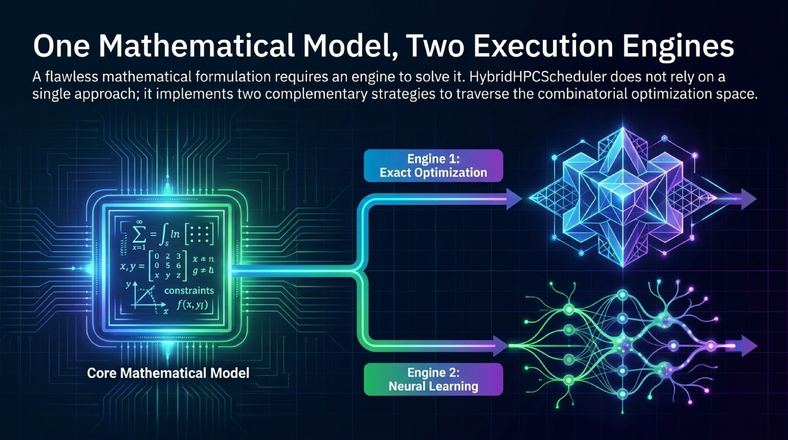
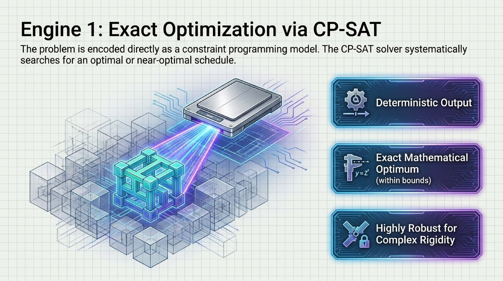
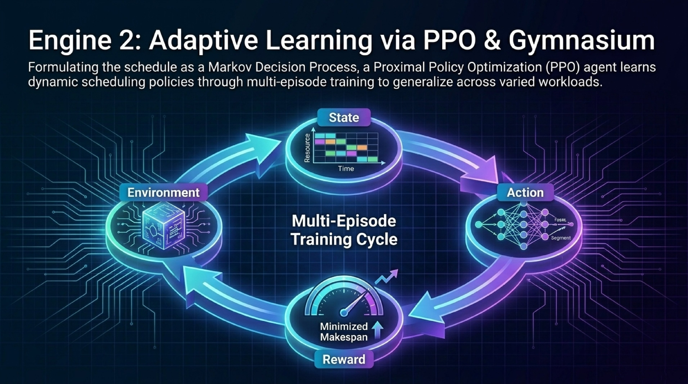
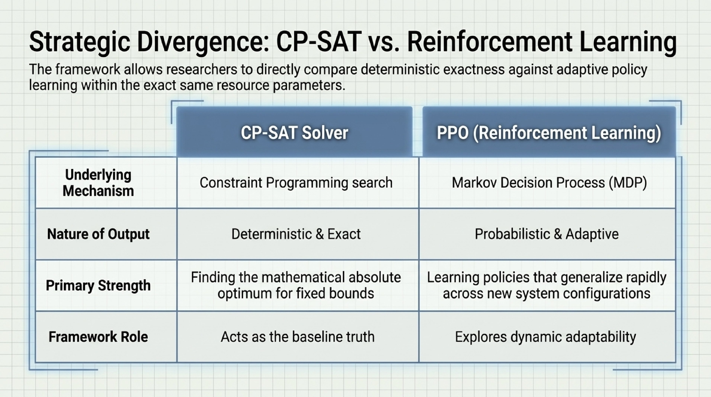
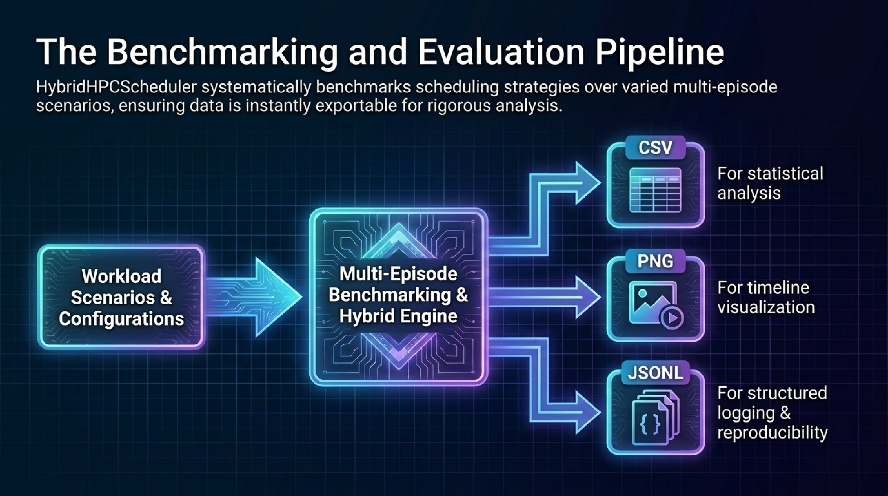

---

---

## 📝 **Author**

**Dr. Patrick Lemoine**  
*Engineer Expert in Scientific Computing*  
[LinkedIn](https://www.linkedin.com/in/patrick-lemoine-7ba11b72/)

---

